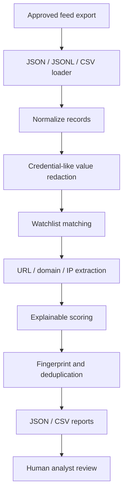

# Architecture

```mermaid
flowchart TD
 A[Approved feed export] --> B[JSON / JSONL / CSV loader]
 B --> C[Normalize records]
 C --> D[Credential-like value redaction]
 D --> E[Watchlist matching]
 E --> F[URL / domain / IP extraction]
 F --> G[Explainable scoring]
 G --> H[Fingerprint and deduplication]
 H --> I[JSON / CSV reports]
 I --> J[Human analyst review]
```

Input files are untrusted. Reports may contain sensitive context. The prototype never contacts extracted indicators.
